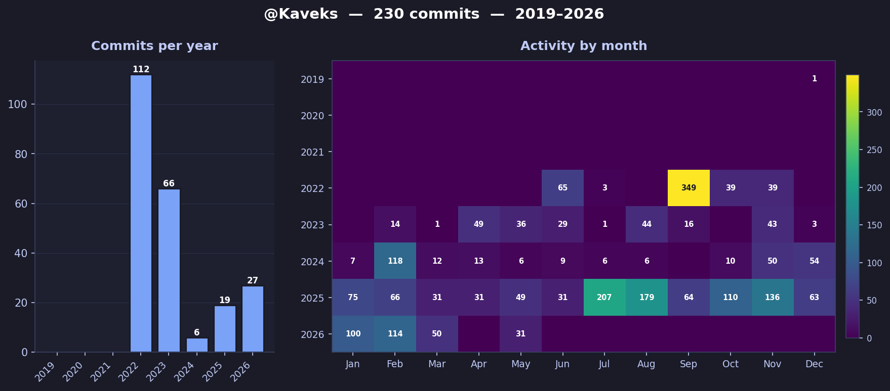

<h1 align="center">Hi, I'm Patrick Mbugua 👋</h1>
<h3 align="center">Fullstack Developer · Kenya 🇰🇪</h3>

  
  

---

### About me

- 🌱 Currently learning **Kotlin Multiplatform**, and working on **Mifos Mobile**, **Fineract**, and **Mifos Wallet** infrastructure
- 👨‍💻 Portfolio → **[know-patrick.vercel.app](https://know-patrick.vercel.app/)**
- 💬 Ask me about **Kubernetes**, **Docker**, **Python/Django/FastAPI**, **React/Next.js**, **TypeScript**, **Tailwind CSS**, **shadcn/ui**, **Celery**, **RabbitMQ**, **Redis**
- 📫 Reach me at **pkaveks2@gmail.com**

### Connect

  
  
  

---

### Tech stack

**Languages**

**Frontend**

**Backend**

**DevOps & cloud**

**Tools**

---

### Trophies

  

### GitHub stats

  
  

  

### Contribution history

  

> Auto-regenerated everyday(midnight) by [`.github/workflows/contributions.yml`](.github/workflows/contributions.yml). The chart is committed back to this repo so the README always shows the latest data.

---

<i>"Build. Break. Learn. Repeat."</i>

